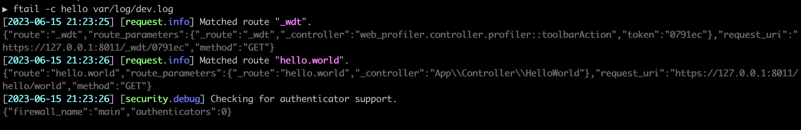

ftail
-----



`ftail` is a log tailing library, configurable with `yaml`, [`symfony/expression-language`](https://symfony.com/doc/current/components/expression_language.html), and `php`.

It allows you to `tail` a log file in the format that you like.
It also allows you to exclude certain lines you don't want to see, and/or to replace content for a specific purpose.

⚠️ At the moment, you need logs formatted in `json`. Check out [troubleshooting](#troubleshooting) for more information.

## Requirements

- `php 8+`
- `composer`
- `tail`

## Installation

- Install dependencies:

```php
composer install
```

- You might want to add the binary path to your `~/.bashrc` or `~./zshrc`:

```bash
echo 'export PATH="/path/to/ftail/bin:$PATH"' >> ~/.zshrc

source ~/.zshrc
```

## Usage

- Assuming you added the `ftail` binary path to your `$PATH`:

```bash
ftail path/to/file.log
ftail path/to/file.log -c plain   # select a configuration from the ./config directory
ftail path/to/file.log -l warning # set the minimum log level to `warning`
ftail path/to/file.log -cn event  # restrict log entries to the `event` channel
ftail path/to/file.log --help     # for help
```

- The default configuration is [`config/library/colored.yaml`](./config/library/colored.yaml)
- `ftail` is also shipped with a non-colored version [`config/library/plain.yaml`](./config/library/plain.yaml):

## Custom configuration

One of the main interest of `ftail` is to be able to create a custom configuration for each project or use case that you have, so that you can read your logs comfortably.

- Copy the [`config.dist.yaml`](./config.dist.yaml) to `./config/my_config.yaml`
- Then you can use it like this:

```bash
ftail -c my_config path/to/file.log
```

---

Each configuration allows you to customize your own:
- line `reader`: how do you read a line from the log file (`tail` is the default and only one at the moment)
- line `decoder`: how do you decode a single line (`json` is the default and only one at the moment)
- line `formatter`: how do you display a single log line
- `exclusions`: exclude certain lines using [Symfony Expression Language](https://symfony.com/doc/current/components/expression_language.html).
- `replacements`: replace anything within a log line message

Check out [`config.dist.yaml`](./config.dist.yaml) and [`ColoredFormatter`](./src/Formatter/ColoredFormatter.php) and [`PlainFormatter`](./src/Formatter/PlainFormatter.php) for more information on how to create your configurations.

Also check the [Symfony Expression Language syntax](https://symfony.com/doc/current/reference/formats/expression_language.html).

## Troubleshooting

> I'm using Symfony with Monolog in a project, but it does not have `json` logs, and I don't want to alter the configuration for everyone.

A solution would be to create a folder inside your packages, with your configuration:

```tree
└── packages
    ├── ftail
    │   ├── .gitignore   # just add a * in the file and the directory won't be tracked
    │   └── monolog.yaml # your configuration with json logs
    └── monolog.yaml     # project configuration
```

> How do I configure monolog to output `json` within a Symfony project?

Like this:

```yaml
monolog:
  handlers:
    main:
      type: stream
      path: "%kernel.logs_dir%/%kernel.environment%.log"
      formatter: 'monolog.formatter.json' # add this line
```

## Contributing

Feel free to create your own readers, decoders & formatters. Add them to this repository if you think they might be useful to others.
